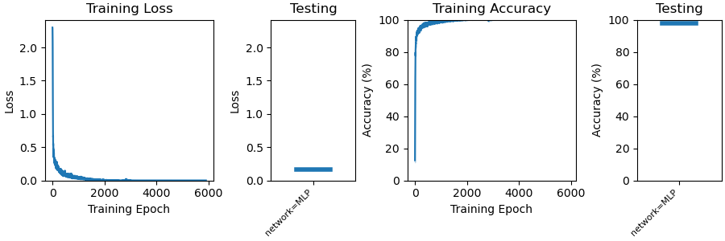
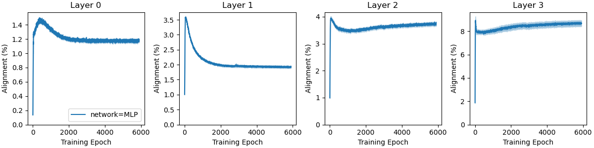
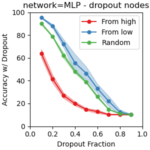
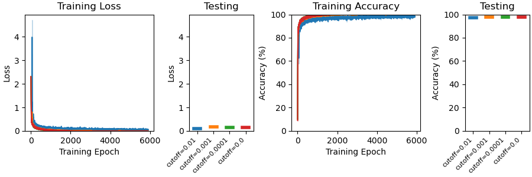
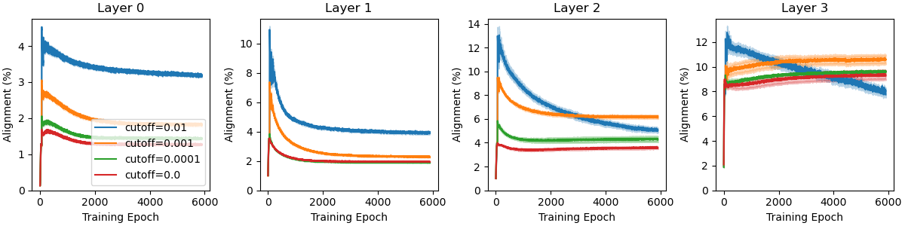
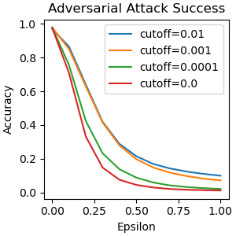

# Theoretical Background
The central theoretical idea of this project is a statistical measurement that we call the "alignment metric", which is closely related to a well understood quantity called the [Rayleigh Quotient](https://en.wikipedia.org/wiki/Rayleigh_quotient). For a given real square matrix $M$ and a nonzero vector $w$, the formula of the Rayleigh Quotient is: $R(M, x) = \frac{x^TMx}{x^Tx}$.

For our case, the $M$ matrix will represent the covariance matrix of the input to a layer in a neural network, and the $x$ vector will represent the learned weights of a node in a neural network[^1]. In this case (changing notation), if $X\in\mathbf{R}^{(Dim, Samples)}$ is a centered minibatch and $w$ is a weight vector of a particular node in a network, then the Rayleigh Quotient is $R(XX^T, w) = \frac{w^TXX^Tw}{w^Tw}$. 

Intuitively, the Rayleigh Quotient measures the variance of a projection from the dataset $X$ onto the weight vector $w$. In other words, $var(X^Tw)=R(XX^T, w)$. It is easy to show (see the wikipedia article) that the maximum (minimum) possible value of the RQ is the largest (smallest) eigenvalue of $XX^T$, which takes place when $w$ is equal to the first (last) principal component. Therefore, to normalize the Rayleigh Quotient across datasets, we scale $R$ by the sum of the eigenvalues and call this "alignment", where $A = \frac{R(XX^T, w)}{tr(XX^T)}$.

#### Alignment across network layers
Deep networks often have many layers. To measure the alignment of each layer, we simply consider $w$ to be the learned weight of layer $L$ and $X$ to be the output of layer $L-1$. 

#### Comments on Batch Size
The alignment metric is defined as the limit when the number of samples in $X$ approaches infinity (or the maximum number of samples in the dataset). Therefore, since in practice alignment will be measured with minibatches of $X$, it is an estimate of the true alignment. Because of this, batch sizes must be large enough that the eigenspectrum of the minibatch approximates the eigenspectrum of the full dataset. This is an empirical question for each dataset (and model, because the eigenspectrum of the hidden activations of a minibatch should also approximate the eigenspectrum of the hidden activations of the full dataset). 

#### A quick note on implementation
We have attempted to implement the alignment metric computation as efficiently as possible. However, it's possible that this could be improved! The ``alignment`` function is currently located in the ``utils.py`` module and uses the following lines of code (where ``input`` is the input data with shape ``(batch_size, dim)`` and ``weight`` is a weight matrix with shape ``(dim_out, dim_in)``)[^2]: 

```python
cc = torch.cov(input.T)
rq = torch.sum(torch.matmul(weight, cc) * weight, axis=1) / torch.sum(weight * weight, axis=1)
return rq / torch.trace(cc)
```

# Basic Results
To demonstrate the applications of the method, here we include some basic alignment analyses applied to a simple network. We trained a 4-layer feedforward network with ReLU activations to classify the MNIST dataset. The width of the network across the 5 layers (including the input layer) is 784-100-100-50-10, it was trained with the Adam optimizer and cross-entropy loss. The network learns:



For each minibatch in training, we measured the alignment between the input to each layer and the weight matrix of the layer, then plotted the average +/- standard error for the alignment of every neuron within a layer (independently for each layer). 



There are several interesting things to note. 
1. The alignment starts low and quickly increases. This corresponds to the layers having random initial tuning, then subsequently becoming aligned to the first few principal components at the beginning of training. 
2. The alignment drops as the training performance becomes better with very similar timescales. This corresponds to each layer learning combinations of principal components that maximize performance (maybe the independent components of the data?). 
3. The alignment trajectory is similar across layers - so each layer learns the structure in its respective input at the same rate. 
4. Smaller note: the alignment scale matches the reciprocal of the width of the layer, which makes sense because as the dimensionality grows the fraction of variance that can be projected onto a single vector shrinks. 

### Application to Network Pruning
Pruning a network is an important engineering tool for reducing the size of a network such that it requires less compute but maintains the same performance. We tested node dropout (dropping out nodes rather than synapses) and found that low-alignment nodes are less important for performance than high-alignment nodes. To do this experiment, we first trained a network to asymptotic performance (the same network as shown above), measured the post-training alignment of each node, and then dropped out an increasing fraction of nodes from the entire network. We dropped out a constant fraction of nodes per layer, all at the same time, and increased the fraction from 0.1 to 0.9. 



As you can see, dropping out 10% of nodes reduces accuracy from ~97% to 60% if we dropout the highest alignment nodes, and barely affects the network if we dropout random nodes or the lowest alignment nodes.

### Application to adversarial robustness
Adversarial attacks can be used to fool a network into classifying an image incorrectly even though the adversarial image is almost identical to one that it classified correctly (in the L2 sense). This is problematic. Given the fact that the difference between a correct image and an adversarial one is low amplitude and usually high frequency, the difference is likely composed of low-variance principal components - precisely the ones that reduce the alignment of a network. 

To test whether alignment can be used to reduce susceptibility to adversarial attack, we trained a network while periodically removing the contribution of low-variance principal components to the weights. We removed weights contributing less than 0.01, 0.001, or 0.0001 (or not removing any), then tested the performance of the network, and measured the relationship between the amplitude of an adversarial attack and the reduction in performance. 





These first two figures demonstrate that the networks all achieve typical performance regardless of which fraction of low-variance principal components are removed from the weights. 



This plot compares the adversarial "epsilon" to the accuracy of a batch. We used the binarized signed gradient attack method, in which the epsilon value is multiplied by the gradient to scale the amplitude of the attack. As the epsilon value increases, the performance drops, but this happens only at higher amplitudes when more of the low-variance PCs are trimmed from the network. 


[^1]: Note: this can be applied for any type of layer as long as it performs a matrix multiplication between inputs and weights, e.g. convolutional layers, transformers, etc.

[^2]: Note that depending on the kwargs, the correlation can be used instead of the covariance and the division by the trace may be omitted, but this code snippet contains the key